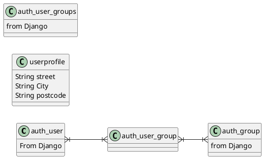
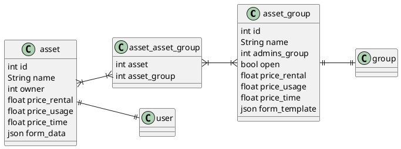
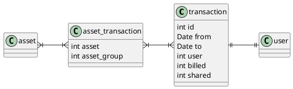

# Database

The database will be a relational DB.
This is as I think the DB should only do this. No fancy stuff needed as far as I know

Following I will describe the sections used in the database. This should somehow be implemented in services.

## Users

Anything related to user management. This will be straight forward to enable RBAC stuff

### Entities
As we will use Django for first backend things we use the auth stuff from over there.
This will help to keep the code base a bit lower.

As the stuff is not a full version of what we want we extend the user. This is done via option  of this tutorial: https://simpleisbetterthancomplex.com/tutorial/2016/07/22/how-to-extend-django-user-model.html

### Design

## Assets

Assets are all the goods we want to share. The assets are organized in groups as well. This will enable a dynamic community  which can grow above the first idea of sharing what ever.

### Entities

The asset is what we really want to share. This is holding a could of information about the thing itself.
To be open for anything we habe not in mind we add a json field. This can be populated dynamically from the template in the group.

The group is describing everythign that can be shared.
We also hold an json field to be open to user mods.

### Design

## Transactions

Transactions are all the actions we did to our assets.

### Design

